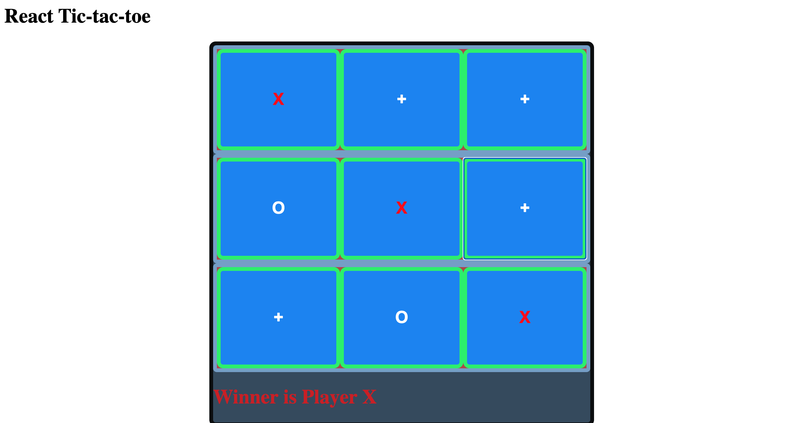

## React Tic-Tac-Toe
##### Title:
  React Tic-Tac-Toe
### Description: 
  This project allows players to play Tic-Tac-Toe using React.
  

##### How to Run: 
  download repository, npm install from repository, start server
  
##### Roadmap of future improvements: 
  - [x] Stop accepting input on pre-selected square or after winner determined
    - To disable clicking, I would remove the takeTurn function from the Square. Then within the Square, I would wrap the wrap the onClick block in an if statement requiring (takeTurn && tik = 2).
  - [x] Only state winner statement if winner is determined
    - To limit the win status to after the win, I would adjust the status variable and the checkForWinner function. I would remove the string formatter and only return text from checkForWinner after a win.
 
##### License information: 
  MIT license. 